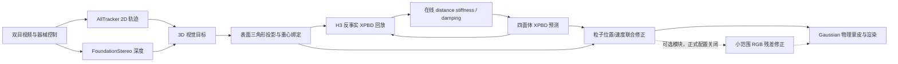

# Embodied Gaussians for Deformable Surgical Tissue

基于物理粒子、3D Gaussian Splatting、稠密视觉轨迹与在线材料辨识的软组织重建和未来预测系统。

<div align="left">
  
</div>

[原始 Embodied Gaussians 项目](https://embodied-gaussians.github.io/) ·
[原始论文](https://openreview.net/forum?id=AEq0onGrN2) ·
[grasp1/grasp3/grasp5 新 Joint 协议三次结果](SUPER_JOINT_GRASP135_EVALUATION.md) ·
[EndoGaussian baseline 与结果](baselines.md) ·
[EndoGaussian 机器可读结果](results/endogaussian_super_v1/) ·
[当前 f1/f2 结果](CURRENT_F1_F2_EVALUATION.md) ·
[机器可读结果](results/super_grasp5_reconstruction_f1_future_f2_v1.csv) ·
[grasp1/grasp3 三次评测](SUPER_GRASP1_GRASP3_EVALUATION.md) ·
[历史三次重复记录](SOFT_H3_THREE_RUN_EVALUATION.md) ·
[完整评测协议](SUPER物理重建与未来预测评估协议.md) ·
[开发记录](PROGRESS.md)

## 项目概览

本仓库从 **Physically Embodied Gaussian Splatting** 出发，将视觉表示和物理表示统一到同一组可变形组织上，并针对 SUPER 双目手术视频增加了完整的软组织处理链：

- 使用四面体 XPBD 模拟组织的距离、体积、形状和接触约束；
- 使用 [AllTracker](https://alltracker.github.io/) 跟踪图像中的组织运动；
- 使用 [FoundationStereo](https://nvlabs.github.io/FoundationStereo/) 深度先验把 2D 轨迹提升为 3D 目标；
- 将 3D 目标投影并绑定到物理表面三角形，通过联合最小二乘同时修正粒子位置和速度；
- 保留轨迹后 RGB 残差模块用于消融，但当前正式配置关闭它，避免外观梯度扰动几何状态；
- 使用视觉修正前的物理预测误差，在训练帧内在线辨识全局 distance stiffness 和速度阻尼；
- 将物理粒子的形变传给绑定的 3D Gaussians，使其位置、方向和尺度随组织表面变化；
- 同时评估 `7:1` 重建和 `80:20` 严格开放环未来预测。

当前正式版本使用较软初值 `distance=0.01`、`shape=0.0005` 和 **全局强 H3**；
关闭轨迹后 RGB residual、`3-of-4 H3`、累计局部刚度场以及 Gaussian 颜色/不透明度
学习。Reconstruction 使用覆盖 `0..1439` 的完整 f1，Future 使用训练前缀内的 f2；
二者不再共享同一个轨迹采样率。

## EndoGaussian baseline

当前已完成 EndoGaussian 在 SUPER `grasp5`、`grasp3`、`grasp1` 上的正式评测，
每个数据集使用 seed 0、1、2 实际训练三次。官方代码固定到提交
`8d12793838a1595b299df0696c8149c07329e980`，训练和变形模型保持原样；适配层只负责
SUPER 数据、完整非中心主点相机、严格帧划分和统一结果导出。

EndoGaussian 原代码没有点轨迹接口。当前导出器参考 Shape of Motion 提交
`579753e1c7ba96f60cd7690e5b835627bd1935e9` 的查询几何属性光栅化方式，从冻结的
EndoGaussian 高斯形变场读取轨迹。这里只采用解码设计，没有运行 Shape of Motion
模型，也没有使用它的权重、轨迹、深度或 evaluator。

正式协议为 `joint_reconstruction_7to1_future_80to20`：训练前 80% 中每八帧留出一帧
做 Reconstruction，最后 20% 完全停止读取 RGB、深度、mask 和轨迹观测，直接评估
EndoGaussian 原生时间变形场的 Future 外推。轨迹指标不做尺度、ICP、刚体对齐或后验
校正。9 份报告均通过 GT 哈希、完整轨迹日程、观测留出和渲染分区检查。

| 数据集 | 分区 | 3D (mm) ↓ | 2D (px) ↓ | PSNR (dB) ↑ | SSIM ↑ | LPIPS ↓ |
|---|---|---:|---:|---:|---:|---:|
| grasp5 | Reconstruction | 10.784 ± 1.285 | 26.116 ± 0.193 | 28.307 ± 0.015 | 0.8844 ± 0.0006 | 0.2713 ± 0.0008 |
| grasp5 | Future | 10.482 ± 1.298 | 21.805 ± 0.035 | 26.700 ± 0.069 | 0.8356 ± 0.0010 | 0.2883 ± 0.0019 |
| grasp3 | Reconstruction | 5.959 ± 0.831 | 27.187 ± 0.690 | 28.286 ± 0.010 | 0.8829 ± 0.0000 | 0.2681 ± 0.0010 |
| grasp3 | Future | 5.193 ± 0.905 | 19.143 ± 0.376 | 27.029 ± 0.048 | 0.8494 ± 0.0019 | 0.2891 ± 0.0013 |
| grasp1 | Reconstruction | 6.567 ± 1.071 | 28.490 ± 0.507 | 28.342 ± 0.023 | 0.8841 ± 0.0003 | 0.2759 ± 0.0012 |
| grasp1 | Future | 6.183 ± 0.984 | 35.868 ± 0.421 | 27.401 ± 0.056 | 0.8512 ± 0.0018 | 0.2838 ± 0.0006 |

数值为三次均值 ± 总体标准差。完整算法说明、数据版本和命令见
[baseline 适配文档](baselines.md)，逐次 JSON、预测轨迹、协议审计和代表性视频见
[EndoGaussian 结果目录](results/endogaussian_super_v1/)。

## 整体方法



系统的关键不是每帧直接移动某一个孤立粒子，而是建立一条可解释的闭环：

1. 物理模型先预测下一状态；
2. 视觉轨迹提供组织表面的绝对位置和增量运动；
3. 多条重叠轨迹作为一个联合约束系统修正物理状态；
4. 可选 RGB 模块只处理剩余的小尺度误差，正式评估中关闭；
5. 物理预测与视觉观测之间的系统性差异用于估计材料参数；
6. 测试未来时冻结所有视觉和材料更新，只保留已知器械控制和 XPBD 前向模拟。

### 1. 双表示：物理粒子与 3D Gaussians

组织由四面体粒子网格负责动力学，由表面 3D Gaussians 负责可微渲染。Gaussian 中心通过固定重心权重绑定到物理表面；其完整静止协方差由表面三角形形变传输：

\[
\mu_g^t=\sum_i w_{gi}x_i^t,
\qquad
\Sigma_g^t=F_g^t\Sigma_g^0(F_g^t)^\top .
\]

因此组织拉伸和剪切时，Gaussian 不仅移动，其方向和尺度也会随局部表面变化。正式版本不在线学习颜色或不透明度，避免外观自由度反过来破坏几何轨迹。

### 2. 从 2D 轨迹和深度得到 3D 目标

给定左目轨迹像素 \((u,v)\)、深度 \(Z\) 和相机内参，先反投影到左相机坐标：

\[
X=\frac{(u-c_x)Z}{f_x},\qquad
Y=\frac{(v-c_y)Z}{f_y},\qquad
p_C=[X,Y,Z]^\top,
\]

再通过冻结外参变换到仿真世界坐标。每条初始 3D 轨迹投影到最近的物理表面三角形，并记录三个顶点和重心权重：

\[
\hat y_{j,t}=B_jx_t
=b_{j1}x_{i_1,t}+b_{j2}x_{i_2,t}+b_{j3}x_{i_3,t},
\qquad \sum_m b_{jm}=1.
\]

这种绑定在整个序列中保持身份不变；不会逐帧重新寻找最近粒子，从而避免通过“换点”虚假降低误差。

### 3. 轨迹视觉状态修正

轨迹观测同时包含相对上一帧的 3D flow 和相对查询帧的绝对 3D 位置。系统融合两种 innovation，并对所有相互重叠的三角面约束执行一次稳健联合求解：

\[
\Delta x^*=\arg\min_{\Delta x}
\sum_j c_j\,\rho\!\left(B_j\Delta x-r_j\right)
+\lambda\lVert\Delta x\rVert_2^2.
\]

固定粒子通过逆质量保持不动；动态粒子的更新由逆质量、轨迹置信度和稳健权重共同决定。位置与速度分别求解：

\[
x_t^{acc}=x_t^{pred}+\alpha_x\Delta x^*,
\qquad
v_t^{acc}=v_t^{pred}+\alpha_v\Delta v^*.
\]

这一步解决了仅修正增量流无法消除累计位置漂移，以及逐轨迹独立传播造成约束串扰的问题。

### 4. 可选的轨迹后 RGB 微修正

稀疏/稠密轨迹主要约束几何运动，但不能覆盖所有组织纹理和轮廓。代码保留了一个轨迹
状态接受后的 RGB 微修正模块，可在组织 mask 内对受物理绑定约束的 Gaussian/粒子位置
执行小范围优化。消融实验发现它可能改善局部图像损失，但也会把颜色/遮挡误差写入几何
和速度，因此当前正式评估设置 `trajectory_rgb_residual_enabled=0`。

即使显式启用，RGB 修正也只属于训练帧状态观测器，不参与留出重建帧或未来 20% 帧。
Gaussian 颜色和不透明度在线优化在正式版本中同样关闭。

### 5. H3 在线刚度与阻尼辨识

材料辨识使用视觉修正前保存的物理预测 \(x_h^{pred}\)，否则观测器已经消除的误差会掩盖错误材料参数。连续三个有效视频转移的轨迹损失为：

\[
L_{track}^{(h)}=
\frac{\sum_j c_{j,h}\,
\rho\!\left(B_jx_h^{pred}-y_{j,h}\right)}
{\sum_j c_{j,h}+\epsilon},
\]

\[
L_{H3}(\theta)=
\frac{\sum_{h=1}^{3}w_hL_{track}^{(h)}}{\sum_{h=1}^{3}w_h}
+\frac{0.4}{3}\left(\theta_d^2+\theta_\gamma^2\right),
\qquad w=(1.5,2,3).
\]

其中 \(\theta_d=\log(k_d/k_{d,0})\) 表示全局 distance stiffness 的 log 倍率，\(\theta_\gamma=\log(\gamma/\gamma_0)\) 表示全局速度阻尼倍率。每个扰动候选都从相同历史状态、器械控制和接触状态执行真实的连续 XPBD 反事实回放。

中心差分梯度为：

\[
g_i^{H3}=\frac{L_{H3}(\theta+\delta e_i)-L_{H3}(\theta-\delta e_i)}{2\delta},
\qquad \delta=0.005.
\]

H3 梯度还要与独立 restarted one-step surrogate 的梯度同向：

\[
\cos(g^{H3},g^{sur})\ge 0.95,
\qquad
g^{H3}\cdot\Delta\theta<0.
\]

通过后使用 Adam 更新，学习率为 `0.03`。当前强 H3 将实际单次最大 log step 放宽到
`0.08`，但仍使用相同的可观测性、下降方向和物理安全检查。当前固定参数和边界如下：

| 参数 | 正式值 |
|---|---:|
| 初始 distance stiffness | `0.01` |
| distance 搜索边界 | `0.00001 .. 4.0` |
| shape stiffness | `0.0005`，固定 |
| volume stiffness | `100000`，固定 |
| damping 搜索边界 | `2 .. 30 /s` |
| Reconstruction 累计 log 范围 | `0.60` |
| Future 累计 log 范围 | `0.80` |
| 轨迹 robust scale | `0.2 mm` |

Reconstruction 在完整 f1 的合法七帧训练块内使用互不重叠的 H3；Future 在 f2 训练区间使用
H3-based available H2–H3。所有 Future 材料更新在 frame 1152 前结束，之后只执行冻结
材料参数的开放环 XPBD。旧小步 H3 的历史配置见 [H3刚度正式记录.md](H3刚度正式记录.md)，
当前强 H3 配置和 f1/f2 结果见 [当前评估记录](CURRENT_F1_F2_EVALUATION.md)；历史三次
记录见 [较软参数三次重复评估](SOFT_H3_THREE_RUN_EVALUATION.md)。

## 评测协议

### Reconstruction：7:1

完整视频每八帧留出一帧。其余七帧可以执行轨迹、RGB 和材料更新；留出帧的图像只能用于计分，不能回写物理状态或材料参数。这对应 EH-SurGS 风格的重建/重放评估。

AllTracker 资产采用完整 f1：帧号严格覆盖 `0..1439`，共1440个轨迹帧和1439个相邻
转移。每个留出帧及与其相连的转移均由因果门禁止回写。

### Future prediction：80:20

`grasp5` 共使用 1440 帧：

- frame `0..1151`：训练、视觉状态估计与材料辨识；
- frame `1152..1439`：冻结视觉和材料更新，严格开放环预测；
- 训练视觉轨迹使用 f2：`0,2,...,1150` 共576帧、575个转移；
- 测试区间仍输入真实器械运动，作为所有方法共享的已知控制量。

### 指标

- **3D Tracking error (mm) ↓**：预测持久 Gaussian 与双目深度反投影真值的平均欧氏距离；
- **2D Tracking error (px) ↓**：同一持久 Gaussian 投影与人工 2D 标注的平均欧氏距离；
- **PSNR ↑ / SSIM ↑ / LPIPS ↓**：stereo-left、`960×540`、相同器械 mask 下的渲染质量；
- 不进行 ICP、尺度或逐帧刚体对齐。

当前人工真值包含 149 个采样帧、每帧 10 点，共 1490 个已人工确认的 2D 观测；3D 真值由高置信双目深度反投影获得。更完整的可见性、深度置信和计分定义见 [SUPER物理重建与未来预测评估协议.md](SUPER物理重建与未来预测评估协议.md)。

## 正式测评结果

当前固定协议是 **Reconstruction 完整 f1 + Future 训练前缀 f2**。两者均使用
`distance=0.01`、`shape=0.0005`、`volume=100000`，关闭 post-trajectory RGB residual
和局部刚度。完整数值、统计口径及 f1 Future 消融见
[当前 f1/f2 评估记录](CURRENT_F1_F2_EVALUATION.md) 和
[CSV 数据](results/super_grasp5_reconstruction_f1_future_f2_v1.csv)。大型逐帧 capture、
视频和 checkpoint 不上传 GitHub。

### Reconstruction 7:1

| 方法 | 3D Tracking (mm) ↓ | 2D Tracking (px) ↓ | PSNR ↑ | SSIM ↑ | LPIPS ↓ |
|---|---:|---:|---:|---:|---:|
| Pure PBD | 1.5567 ± 0.0073 | 26.9999 ± 0.1897 | **22.5517 ± 0.0250** | 0.778532 ± 0.000666 | **0.473345 ± 0.001702** |
| PBD + trajectory | 0.8300 ± 0.0604 | 11.4060 ± 0.5819 | 22.3312 ± 0.0274 | **0.784091 ± 0.000987** | 0.476360 ± 0.001918 |
| **PBD + trajectory + strong H3** | **0.8072 ± 0.0233** | **10.8082 ± 0.1885** | 22.3912 ± 0.0709 | 0.783667 ± 0.002033 | 0.477435 ± 0.002784 |

按三次合并均值，强 H3 相对 trajectory 将3D/2D误差降低约 **2.7% / 5.2%**，相对
Pure PBD 降低约 **48.1% / 60.0%**。旧三次 Reconstruction 资产只覆盖到 frame 1150，
因此其均值不再使用；当前表按指定口径合并一个旧代码完整f1结果和两个当前代码结果，
三者均通过完整性验收，但不宣称为完全相同代码的三次重复性实验。

### Future 80:20

| 方法 | 3D Tracking (mm) ↓ | 2D Tracking (px) ↓ | PSNR ↑ | SSIM ↑ | LPIPS ↓ |
|---|---:|---:|---:|---:|---:|
| Pure PBD | 1.7737 ± 0.0916 | 28.8022 ± 1.0568 | **21.8378 ± 0.0349** | 0.749554 ± 0.000979 | 0.478783 ± 0.001678 |
| PBD + trajectory | 1.2836 ± 0.1769 | 17.1502 ± 2.0488 | 21.4792 ± 0.1115 | 0.745853 ± 0.003038 | 0.481951 ± 0.005118 |
| **PBD + trajectory + strong H3** | **0.9066 ± 0.1217** | **11.8987 ± 1.1069** | 21.7299 ± 0.1303 | **0.756029 ± 0.004701** | **0.471774 ± 0.004615** |

按三次均值，强 H3 相对 trajectory 将开放环 Future 的 3D/2D 误差降低约
**29.4% / 30.6%**，并同时改善 PSNR、SSIM 和 LPIPS；相对 Pure PBD 的 3D/2D
降幅约 **48.9% / 58.7%**。H3 的 Future SSIM 和 LPIPS 优于 Pure PBD，但 PSNR 仍低
约 `0.108 dB`，所以这里同样不宣称对 Pure PBD 的所有渲染指标全面领先。

Future 表保留三次 f2 运行的 `mean ± sample std`；其输入并不存在 frame 1152 及之后的
视觉观测，因此测试段天然开环。当前结果证明 Future 优势在三次重复中保持，但样本量
仍然只有三次且只来自 `grasp5`，不能替代跨序列统计。

## 安装

推荐 Linux、Python 3.11、CUDA 12.4 和 NVIDIA GPU。

```bash
git clone --recursive \
  https://github.com/wad157/Embodied_gaussians_fixed_super_best.git
cd Embodied_gaussians_fixed_super_best

# 安装 pixi 后构建 Python/CUDA 依赖
pixi run build
```

如果已经普通 clone，需要补齐固定的第三方子模块：

```bash
git submodule update --init --recursive
```

主要依赖由 [pyproject.toml](pyproject.toml) 管理，包括 PyTorch、Warp、gsplat、OpenCV、LPIPS、TetGen 和 FFmpeg。AllTracker 与 FoundationStereo 作为 Git submodule 固定代码版本，其模型 checkpoint 需按照各自上游项目说明下载。

## 数据准备

`data/`、`outputs/` 和模型 checkpoint 体积较大且包含本机实验资产，因此有意排除在 Git 之外。仅 clone 代码不能直接复现 `grasp5` 数值；需要准备：

```text
data/super/grasp5_native/                  # 双目图像、深度、标定和组织资产
data/super/grasp5_offline_demo/            # 离线视频、相机和器械控制
data/super/evaluation_v1/                  # 人工 2D/3D tracking 真值
third_party/AllTracker/checkpoints/         # AllTracker 权重
third_party/FoundationStereo/pretrained_models/  # FoundationStereo 权重
```

从原始 SUPER bag 到 rectified 双目帧、深度、场景、软组织、Gaussian 和真值的历史处理步骤记录在 [PROGRESS.md](PROGRESS.md)。关键入口包括：

```bash
# 生成 FoundationStereo 时序深度
pixi run python scripts/generate_super_depth_foundation_timestamped.py --help

# 由人工 2D 标注和严格双目深度生成 2D/3D GT
pixi run python scripts/prepare_super_tissue_evaluation_gt.py --help

# 检查数据预处理完整性
pixi run python scripts/validate_super_preprocessing.py --dataset grasp5
```

## 运行与复现

### 上游示例

```bash
pixi run demo
```

### SUPER 离线交互运行

```bash
bash scripts/run_demo_thinlinc.sh --psm-pose-driver depth_then_visual
```

远程图形环境可先运行：

```bash
bash scripts/run_demo_thinlinc.sh --check-virtualgl
```

### 当前正式三方法评估

```bash
bash scripts/run_super_grasp5_reconstruction_f1_full_pipeline.sh \
  outputs/<new-full-f1-asset-directory> \
  outputs/<new-evaluation-directory>
```

该流水线先分段生成完整 `0..1439` Reconstruction f1 资产，然后用已有 Future f2 训练
资产，从头生成 Pure PBD、trajectory 和 trajectory + strong H3 的六个结果。RGB
residual 和局部刚度默认关闭；Reconstruction/Future 分别使用 GPU0/GPU1。

三次运行完成后，可用以下命令验证配置/代码哈希并生成 `mean ± sample std`：

```bash
python scripts/summarize_super_soft_three_runs.py \
  --run run1=outputs/<run1> \
  --run run2=outputs/<run2> \
  --run run3=outputs/<run3> \
  --output-json outputs/<summary>/average_results.json \
  --output-markdown outputs/<summary>/average_results.md
```

更通用的主入口仍是：

```bash
bash scripts/run_super_alltracker_rgb_observable_adam_full_metrics.sh \
  outputs/<new-output-directory>
```

评测协议的 CPU 单元测试：

```bash
PYTHONPATH=src:scripts pixi run python \
  scripts/test_super_tissue_evaluation.py
```

每次正式结果应保存 `evaluation_results.json`、`METHOD_COMPARISON.json`、`RUN_CONFIGURATION.txt` 和代码/输入 SHA256，避免把不同数据、不同 held-out 划分或不同基线混在同一表格中。

## 目录结构

```text
src/embodied_gaussians/
├── embodied_simulator/        # Gaussian–particle 双表示、蒙皮和渲染
└── physics_simulator/         # XPBD、轨迹观测器、RGB residual、材料更新
examples/
└── example_embodied_super_offline.py  # SUPER 主运行入口
scripts/
├── run_super_*                # 正式评测和消融 wrapper
├── generate_super_*           # 深度与预处理
├── prepare_super_*            # 标定与 GT
└── summarize_super_*          # 指标汇总
third_party/
├── AllTracker/
├── FoundationStereo/
└── Python-SuPer/
```

## 当前限制

- 正式结果目前来自 `grasp5` 单序列，尚不是跨场景统计结论；
- Future 阶段使用真实器械轨迹作为已知控制，不预测器械运动；
- 3D GT 的准确度受双目深度和标定误差限制；
- H3 是全局 distance stiffness 与 damping，尚未证明局部材料场能够稳定提升；
- H3 反事实 XPBD 回放显著降低吞吐率，当前正式系统不是实时实现；
- 完整 f1 Reconstruction 当前为一个旧代码结果加两个当前代码结果的指定口径合并统计，
  尚不是完全相同代码的三次重复性实验；
- GitHub 仓库不包含原始 SUPER 数据、checkpoint 和实验 outputs。

## 与相关工作的关系

本项目不是以下论文的逐字复现，而是组合并扩展了它们的思想：

- [Embodied Gaussians](https://openreview.net/forum?id=AEq0onGrN2)：Gaussian–particle 双表示、可纠正物理世界模型；
- [Liang et al., arXiv:2309.11656](https://arxiv.org/abs/2309.11656)：基于视觉误差的物理参数辨识和已知控制下的未来滚动；
- [PhysTwin, arXiv:2503.17973](https://arxiv.org/abs/2503.17973)：可变形物体的物理重建、未来预测与 tracking/rendering 联合评估；
- [Tracking Everything in Robotic-Assisted Surgery, arXiv:2409.19821](https://arxiv.org/abs/2409.19821)：手术视频人工轨迹标注及像素阈值评价；
- [EH-SurGS, arXiv:2501.01101](https://arxiv.org/abs/2501.01101)：`7:1` 重建划分和器械 mask 下的渲染评价；
- [GauSTAR](https://eth-ait.github.io/GauSTAR/)：Gaussian 与可变形表面几何的绑定思想。

## 引用

本仓库基于 Embodied Gaussians。使用本项目时，请至少引用原始工作：

```bibtex
@inproceedings{
  abouchakra-embodiedgaussians,
  title={Physically Embodied Gaussian Splatting: A Realtime Correctable World Model for Robotics},
  author={Jad Abou-Chakra and Krishan Rana and Feras Dayoub and Niko Suenderhauf},
  booktitle={8th Annual Conference on Robot Learning},
  year={2024},
  url={https://openreview.net/forum?id=AEq0onGrN2}
}
```

## Disclaimer

本代码是研究原型，不是生产级软件。模型权重、数据集和第三方代码分别遵循其原始许可证和使用条款。
