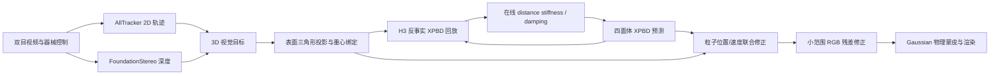

# Embodied Gaussians for Deformable Surgical Tissue

基于物理粒子、3D Gaussian Splatting、稠密视觉轨迹与在线材料辨识的软组织重建和未来预测系统。

<div align="left">
  
</div>

[原始 Embodied Gaussians 项目](https://embodied-gaussians.github.io/) ·
[原始论文](https://openreview.net/forum?id=AEq0onGrN2) ·
[正式 H3 配置与结果](H3刚度正式记录.md) ·
[完整评测协议](SUPER物理重建与未来预测评估协议.md) ·
[开发记录](PROGRESS.md)

## 项目概览

本仓库从 **Physically Embodied Gaussian Splatting** 出发，将视觉表示和物理表示统一到同一组可变形组织上，并针对 SUPER 双目手术视频增加了完整的软组织处理链：

- 使用四面体 XPBD 模拟组织的距离、体积、形状和接触约束；
- 使用 [AllTracker](https://alltracker.github.io/) 跟踪图像中的组织运动；
- 使用 [FoundationStereo](https://nvlabs.github.io/FoundationStereo/) 深度先验把 2D 轨迹提升为 3D 目标；
- 将 3D 目标投影并绑定到物理表面三角形，通过联合最小二乘同时修正粒子位置和速度；
- 在轨迹修正之后执行一次小范围 RGB 残差修正，补偿轨迹没有覆盖的局部外观误差；
- 使用视觉修正前的物理预测误差，在训练帧内在线辨识全局 distance stiffness 和速度阻尼；
- 将物理粒子的形变传给绑定的 3D Gaussians，使其位置、方向和尺度随组织表面变化；
- 同时评估 `7:1` 重建和 `80:20` 严格开放环未来预测。

当前正式版本是已经完整复现的 **全局 H3 刚度版本**。实验性的 `3-of-4 H3`、累计局部刚度场和 Gaussian 颜色/不透明度学习均未启用。

## 整体方法



系统的关键不是每帧直接移动某一个孤立粒子，而是建立一条可解释的闭环：

1. 物理模型先预测下一状态；
2. 视觉轨迹提供组织表面的绝对位置和增量运动；
3. 多条重叠轨迹作为一个联合约束系统修正物理状态；
4. RGB 只负责剩余的小尺度误差；
5. 物理预测与视觉观测之间的系统性差异用于估计材料参数；
6. 测试未来时冻结所有视觉和材料更新，只保留已知器械控制和 XPBD 前向模拟。

### 1. 双表示：物理粒子与 3D Gaussians

组织由四面体粒子网格负责动力学，由表面 3D Gaussians 负责可微渲染。Gaussian 中心通过固定重心权重绑定到物理表面；其完整静止协方差由表面三角形形变传输：

\[
\mu_g^t=\sum_i w_{gi}x_i^t,
\qquad
\Sigma_g^t=F_g^t\Sigma_g^0(F_g^t)^\top .
\]

因此组织拉伸和剪切时，Gaussian 不仅移动，其方向和尺度也会随局部表面变化。正式版本不在线学习颜色或不透明度，避免外观自由度反过来破坏几何轨迹。

### 2. 从 2D 轨迹和深度得到 3D 目标

给定左目轨迹像素 \((u,v)\)、深度 \(Z\) 和相机内参，先反投影到左相机坐标：

\[
X=\frac{(u-c_x)Z}{f_x},\qquad
Y=\frac{(v-c_y)Z}{f_y},\qquad
p_C=[X,Y,Z]^\top,
\]

再通过冻结外参变换到仿真世界坐标。每条初始 3D 轨迹投影到最近的物理表面三角形，并记录三个顶点和重心权重：

\[
\hat y_{j,t}=B_jx_t
=b_{j1}x_{i_1,t}+b_{j2}x_{i_2,t}+b_{j3}x_{i_3,t},
\qquad \sum_m b_{jm}=1.
\]

这种绑定在整个序列中保持身份不变；不会逐帧重新寻找最近粒子，从而避免通过“换点”虚假降低误差。

### 3. 轨迹视觉状态修正

轨迹观测同时包含相对上一帧的 3D flow 和相对查询帧的绝对 3D 位置。系统融合两种 innovation，并对所有相互重叠的三角面约束执行一次稳健联合求解：

\[
\Delta x^*=\arg\min_{\Delta x}
\sum_j c_j\,\rho\!\left(B_j\Delta x-r_j\right)
+\lambda\lVert\Delta x\rVert_2^2.
\]

固定粒子通过逆质量保持不动；动态粒子的更新由逆质量、轨迹置信度和稳健权重共同决定。位置与速度分别求解：

\[
x_t^{acc}=x_t^{pred}+\alpha_x\Delta x^*,
\qquad
v_t^{acc}=v_t^{pred}+\alpha_v\Delta v^*.
\]

这一步解决了仅修正增量流无法消除累计位置漂移，以及逐轨迹独立传播造成约束串扰的问题。

### 4. 轨迹后的 RGB 微修正

稀疏/稠密轨迹主要约束几何运动，但不能覆盖所有组织纹理和轮廓。轨迹状态接受后，系统在组织 mask 内计算渲染残差，并对受物理绑定约束的 Gaussian/粒子位置执行一次小范围修正。正式 H3 配置的 RGB 位置/速度增益为 `1.0 / 0.15`。

RGB 修正属于训练帧的状态观测器，不参与留出重建帧，也不参与未来 20% 帧。Gaussian 颜色和不透明度优化在正式版本中关闭。

### 5. H3 在线刚度与阻尼辨识

材料辨识使用视觉修正前保存的物理预测 \(x_h^{pred}\)，否则观测器已经消除的误差会掩盖错误材料参数。连续三个有效视频转移的轨迹损失为：

\[
L_{track}^{(h)}=
\frac{\sum_j c_{j,h}\,
\rho\!\left(B_jx_h^{pred}-y_{j,h}\right)}
{\sum_j c_{j,h}+\epsilon},
\]

\[
L_{H3}(\theta)=
\frac{\sum_{h=1}^{3}w_hL_{track}^{(h)}}{\sum_{h=1}^{3}w_h}
+\frac{0.4}{3}\left(\theta_d^2+\theta_\gamma^2\right),
\qquad w=(1.5,2,3).
\]

其中 \(\theta_d=\log(k_d/k_{d,0})\) 表示全局 distance stiffness 的 log 倍率，\(\theta_\gamma=\log(\gamma/\gamma_0)\) 表示全局速度阻尼倍率。每个扰动候选都从相同历史状态、器械控制和接触状态执行真实的连续 XPBD 反事实回放。

中心差分梯度为：

\[
g_i^{H3}=\frac{L_{H3}(\theta+\delta e_i)-L_{H3}(\theta-\delta e_i)}{2\delta},
\qquad \delta=0.005.
\]

H3 梯度还要与独立 restarted one-step surrogate 的梯度同向：

\[
\cos(g^{H3},g^{sur})\ge 0.95,
\qquad
g^{H3}\cdot\Delta\theta<0.
\]

通过后使用 Adam 更新，学习率为 `0.03`，实际单次最大 log step 为 `0.02`。当前固定参数和边界如下：

| 参数 | 正式值 |
|---|---:|
| 初始 distance stiffness | `0.01` |
| distance 搜索边界 | `0.00001 .. 4.0` |
| shape stiffness | `0.0005`，固定 |
| volume stiffness | `100000`，固定 |
| damping 搜索边界 | `2 .. 30 /s` |
| Reconstruction 累计 log 范围 | `0.15` |
| Future 累计 log 范围 | `0.35` |
| 轨迹 robust scale | `0.2 mm` |

Reconstruction 在每个合法的七帧训练块内使用一个互不重叠的 H3；Future 在训练区间使用 H3-based available H2–H3，其中 H2 必须经过独立训练块方向确认。详细提交条件和实际提交帧见 [H3刚度正式记录.md](H3刚度正式记录.md)。

## 评测协议

### Reconstruction：7:1

完整视频每八帧留出一帧。其余七帧可以执行轨迹、RGB 和材料更新；留出帧的图像只能用于计分，不能回写物理状态或材料参数。这对应 EH-SurGS 风格的重建/重放评估。

### Future prediction：80:20

`grasp5` 共使用 1440 帧：

- frame `0..1151`：训练、视觉状态估计与材料辨识；
- frame `1152..1439`：冻结视觉和材料更新，严格开放环预测；
- 测试区间仍输入真实器械运动，作为所有方法共享的已知控制量。

### 指标

- **3D Tracking error (mm) ↓**：预测持久 Gaussian 与双目深度反投影真值的平均欧氏距离；
- **2D Tracking error (px) ↓**：同一持久 Gaussian 投影与人工 2D 标注的平均欧氏距离；
- **PSNR ↑ / SSIM ↑ / LPIPS ↓**：stereo-left、`960×540`、相同器械 mask 下的渲染质量；
- 不进行 ICP、尺度或逐帧刚体对齐。

当前人工真值包含 149 个采样帧、每帧 10 点，共 1490 个已人工确认的 2D 观测；3D 真值由高置信双目深度反投影获得。更完整的可见性、深度置信和计分定义见 [SUPER物理重建与未来预测评估协议.md](SUPER物理重建与未来预测评估协议.md)。

## 正式测评结果

结果目录：`outputs/super_old_h3_reproduction_scale_only_20260903_v1`。该目录不上传 GitHub，但其配置、结果和输入哈希已经记录在 [H3刚度正式记录.md](H3刚度正式记录.md)。以下数值来自同一次冻结三方法评估，代码快照为 `5b075303`。

### Reconstruction 7:1

| 方法 | 3D Tracking ↓ | 2D Tracking ↓ | PSNR ↑ | SSIM ↑ | LPIPS ↓ | FPS ↑ |
|---|---:|---:|---:|---:|---:|---:|
| Pure PBD | 1.546043 mm | 26.946666 px | 22.556952 | 0.778590 | 0.473099 | 6.723 |
| PBD + trajectory + RGB | 0.753540 mm | 10.504686 px | 22.451175 | 0.786105 | 0.473565 | 1.537 |
| **PBD + trajectory + RGB + H3** | **0.727802 mm** | **9.117631 px** | **22.576592** | **0.788351** | **0.472151** | 1.318 |

相对 `trajectory + RGB`，H3 将 Reconstruction 的 3D 误差再降低 **3.42%**、2D 误差再降低 **13.20%**，并同时改善 PSNR、SSIM 和 LPIPS。相对 Pure PBD，正式 H3 在五项质量指标上也全部更优。

### Future 80:20

| 方法 | 3D Tracking ↓ | 2D Tracking ↓ | PSNR ↑ | SSIM ↑ | LPIPS ↓ | FPS ↑ |
|---|---:|---:|---:|---:|---:|---:|
| Pure PBD | 1.589406 mm | 26.737669 px | 21.882809 | 0.751392 | 0.476906 | 5.888 |
| PBD + trajectory + RGB | 1.530379 mm | 20.098441 px | 21.493695 | 0.744701 | 0.484974 | 1.684 |
| **PBD + trajectory + RGB + H3** | **1.263942 mm** | **15.489142 px** | 21.737514 | **0.752663** | 0.478689 | 0.657 |

相对 `trajectory + RGB`，H3 将开放环未来预测的 3D 误差降低 **17.41%**、2D 误差降低 **22.93%**，并改善该基线的三项渲染指标。相对 Pure PBD，H3 的 tracking 和 SSIM 更好，但 PSNR 仍低 `0.145 dB`、LPIPS 仍高 `0.001783`；这里不把它表述为渲染全面领先。

Reconstruction / Future 分别使用 35 / 31 个 tracking 计分帧和 180 / 288 个 rendering 计分帧，3D 覆盖率为 `1.0`。H3 在 Reconstruction 提交 6 次、在 Future 训练区间提交 22 次，Future 的所有材料更新均早于 frame 1152。

FPS 是 NVIDIA A800 上完整评测链路的 `video_frames_per_s`，包含视觉观测、反事实 H3 回放、渲染与计分开销，不代表纯 XPBD 内核速度。当前正式系统不是实时实现。

## 安装

推荐 Linux、Python 3.11、CUDA 12.4 和 NVIDIA GPU。

```bash
git clone --recursive \
  https://github.com/wad157/Embodied_gaussians_fixed_super_best.git
cd Embodied_gaussians_fixed_super_best

# 安装 pixi 后构建 Python/CUDA 依赖
pixi run build
```

如果已经普通 clone，需要补齐固定的第三方子模块：

```bash
git submodule update --init --recursive
```

主要依赖由 [pyproject.toml](pyproject.toml) 管理，包括 PyTorch、Warp、gsplat、OpenCV、LPIPS、TetGen 和 FFmpeg。AllTracker 与 FoundationStereo 作为 Git submodule 固定代码版本，其模型 checkpoint 需按照各自上游项目说明下载。

## 数据准备

`data/`、`outputs/` 和模型 checkpoint 体积较大且包含本机实验资产，因此有意排除在 Git 之外。仅 clone 代码不能直接复现 `grasp5` 数值；需要准备：

```text
data/super/grasp5_native/                  # 双目图像、深度、标定和组织资产
data/super/grasp5_offline_demo/            # 离线视频、相机和器械控制
data/super/evaluation_v1/                  # 人工 2D/3D tracking 真值
third_party/AllTracker/checkpoints/         # AllTracker 权重
third_party/FoundationStereo/pretrained_models/  # FoundationStereo 权重
```

从原始 SUPER bag 到 rectified 双目帧、深度、场景、软组织、Gaussian 和真值的历史处理步骤记录在 [PROGRESS.md](PROGRESS.md)。关键入口包括：

```bash
# 生成 FoundationStereo 时序深度
pixi run python scripts/generate_super_depth_foundation_timestamped.py --help

# 由人工 2D 标注和严格双目深度生成 2D/3D GT
pixi run python scripts/prepare_super_tissue_evaluation_gt.py --help

# 检查数据预处理完整性
pixi run python scripts/validate_super_preprocessing.py --dataset grasp5
```

## 运行与复现

### 上游示例

```bash
pixi run demo
```

### SUPER 离线交互运行

```bash
bash scripts/run_demo_thinlinc.sh --psm-pose-driver depth_then_visual
```

远程图形环境可先运行：

```bash
bash scripts/run_demo_thinlinc.sh --check-virtualgl
```

### 正式 H3 三方法评估

```bash
bash scripts/run_super_reproduce_old_h3_scale_only_three_way.sh \
  outputs/<new-output-directory>
```

该冻结 wrapper 会复用参考评估中的 Pure PBD 与 `trajectory + RGB` capture，只重新计算 H3 第三组，以保证基线输入完全相同。因此除了上述数据和 tracker/depth 产物，还需要本地参考目录：

```text
outputs/super_alltracker_rgb_recon_nonoverlap_h3_full_metrics_20260831_v10/
```

若需要从头重新生成对应方法，主入口是：

```bash
bash scripts/run_super_alltracker_rgb_observable_adam_full_metrics.sh \
  outputs/<new-output-directory>
```

评测协议的 CPU 单元测试：

```bash
PYTHONPATH=src:scripts pixi run python \
  scripts/test_super_tissue_evaluation.py
```

每次正式结果应保存 `evaluation_results.json`、`METHOD_COMPARISON.json`、`RUN_CONFIGURATION.txt` 和代码/输入 SHA256，避免把不同数据、不同 held-out 划分或不同基线混在同一表格中。

## 目录结构

```text
src/embodied_gaussians/
├── embodied_simulator/        # Gaussian–particle 双表示、蒙皮和渲染
└── physics_simulator/         # XPBD、轨迹观测器、RGB residual、材料更新
examples/
└── example_embodied_super_offline.py  # SUPER 主运行入口
scripts/
├── run_super_*                # 正式评测和消融 wrapper
├── generate_super_*           # 深度与预处理
├── prepare_super_*            # 标定与 GT
└── summarize_super_*          # 指标汇总
third_party/
├── AllTracker/
├── FoundationStereo/
└── Python-SuPer/
```

## 当前限制

- 正式结果目前来自 `grasp5` 单序列，尚不是跨场景统计结论；
- Future 阶段使用真实器械轨迹作为已知控制，不预测器械运动；
- 3D GT 的准确度受双目深度和标定误差限制；
- H3 是全局 distance stiffness 与 damping，尚未证明局部材料场能够稳定提升；
- H3 反事实回放和 RGB 反向传播显著降低吞吐率；
- GitHub 仓库不包含原始 SUPER 数据、checkpoint 和实验 outputs。

## 与相关工作的关系

本项目不是以下论文的逐字复现，而是组合并扩展了它们的思想：

- [Embodied Gaussians](https://openreview.net/forum?id=AEq0onGrN2)：Gaussian–particle 双表示、可纠正物理世界模型；
- [Liang et al., arXiv:2309.11656](https://arxiv.org/abs/2309.11656)：基于视觉误差的物理参数辨识和已知控制下的未来滚动；
- [PhysTwin, arXiv:2503.17973](https://arxiv.org/abs/2503.17973)：可变形物体的物理重建、未来预测与 tracking/rendering 联合评估；
- [Tracking Everything in Robotic-Assisted Surgery, arXiv:2409.19821](https://arxiv.org/abs/2409.19821)：手术视频人工轨迹标注及像素阈值评价；
- [EH-SurGS, arXiv:2501.01101](https://arxiv.org/abs/2501.01101)：`7:1` 重建划分和器械 mask 下的渲染评价；
- [GauSTAR](https://eth-ait.github.io/GauSTAR/)：Gaussian 与可变形表面几何的绑定思想。

## 引用

本仓库基于 Embodied Gaussians。使用本项目时，请至少引用原始工作：

```bibtex
@inproceedings{
  abouchakra-embodiedgaussians,
  title={Physically Embodied Gaussian Splatting: A Realtime Correctable World Model for Robotics},
  author={Jad Abou-Chakra and Krishan Rana and Feras Dayoub and Niko Suenderhauf},
  booktitle={8th Annual Conference on Robot Learning},
  year={2024},
  url={https://openreview.net/forum?id=AEq0onGrN2}
}
```

## Disclaimer

本代码是研究原型，不是生产级软件。模型权重、数据集和第三方代码分别遵循其原始许可证和使用条款。
